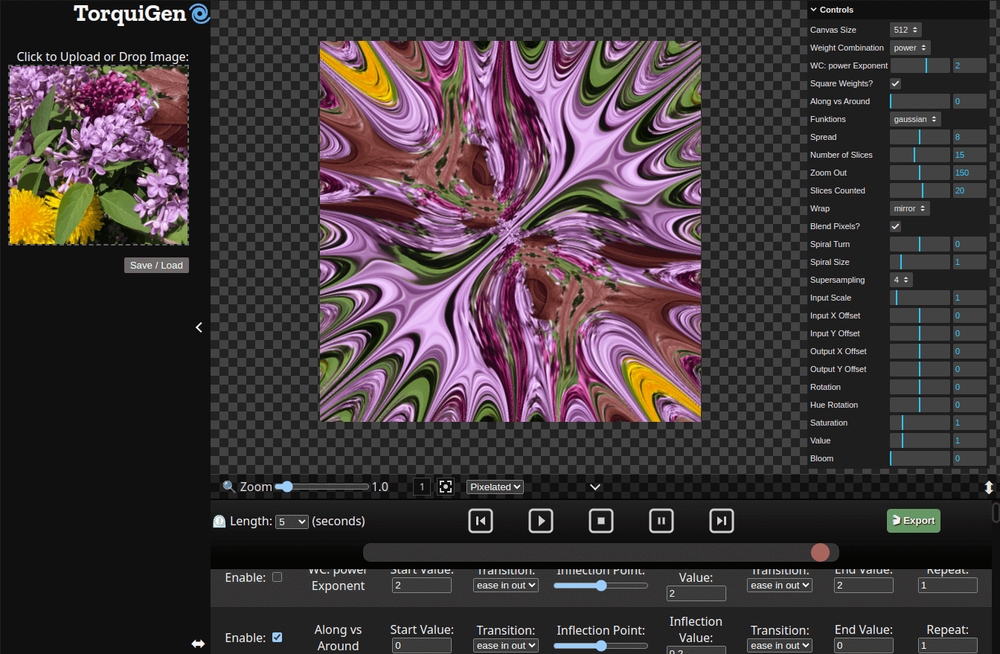

# TorquiGen 🌀

TorquiGen is an exploratory art tool. With TorquiGen, you can create seamless looping animations like this one:

Give it a try by cloning this repo or heading to https://torquigen.app/

## Fun Fact
The name TorquiGen is inspired by the Torquigener genus of pufferfishes native to the Indian and Pacific oceans. These fish are known for their unique ability to build circular structures on sandy sea bottom. [(source)](https://en.wikipedia.org/wiki/Torquigener)

## Features
- A novel symmetry engine, mostly geared towards continuous, radial symmetry
- Support for Firefox, Chrome, and Safari.  Tested on macOS, ipadOS, Linux, and Windows
- Loop-based automation for controls, giving each control a repeating curved based on two 'tween functions
- Webm and GIF export, as well as lossless tar of pngs
- Take stills with screenshots or right click
- Support for high-res output, as well as quality-enhancing Supersampling and Bilinear Filtering
- Several fun effects like bloom, color manipulation, and spiral twisting, all of them automatable.

## Contributing
There are several ways to contribute.  Currently, preset submissions on Discord that we could include in a Preset gallery would be appreciated.  Code and bug fixes welcome as well :)

## Development
The program is all static HTML and assets.  No `npm` is needed, it is all vanilla browser JS.  Cloning it and running a server locally in your prefereed way (such as `python3 -m http.server`) should be all you need to get started.

Please feel free to fork, pull request, make issues.  Contributors are welcome, and can join our [Discord](https://discord.gg/cZYa2bDjs9)

## FAQ

Q: What kind of requirements does TorquiGen have?
A: TorquiGen requres a modern browser like Chrome, Firefox, or Safari with WebGL2 support.

Q: Why is the graphics code so bad?
A: Is it?  I genuinely don't know as this was one of my first attempt at WebGL2 and I don't have much experience with graphics programming.

Q: How can I report a bug or issue with TorquiGen?
A: You can report bugs or issues with TorquiGen by creating an issue on the project's GitHub repository or at our [Discord](https://discord.gg/cZYa2bDjs9)

Q: How can I get help with using TorquiGen?
A: You can get help with using TorquiGen by joining the project's Discord server and asking for assistance there.

# Credits

## Cyclone twemoji svg - Twitter
https://twemoji.twitter.com/
https://creativecommons.org/licenses/by/4.0/

## lil-gui - George Michael Brower
https://lil-gui.georgealways.com MIT

## panzoom - Andrei Kashcha
https://github.com/anvaka/panzoom MIT

## ccapture - Jaume Sanchez Elias
https://github.com/spite/ccapture.js/ MIT

### ccapture deps:

#### webm-writer - Nicholas Sherlock
https://github.com/thenickdude/webm-writer-js WTFPLv2

#### tar.js - T. Jameson Little
https://github.com/beatgammit/tar-js/ MIT

#### gif.js - Joyent, Inc.
https://github.com/jnordberg/gif.js/ MIT

#### gif.worker.js - Johan Nordberg
https://github.com/jnordberg/gif.js/ MIT

#### download.js - dandavis
http://danml.com/download.html MIT

# License
MIT licensed

Copyright (C) 2023 J. Ruiz